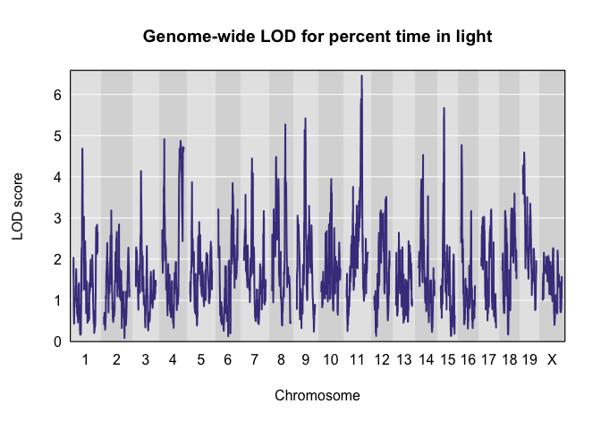

Recla analysis: Updated figures
================
Frederick Boehm
2018-11-18 08:40:33

## Read pvl scan results from files

``` r
library(dplyr)
```

    ## 
    ## Attaching package: 'dplyr'

    ## The following objects are masked from 'package:stats':
    ## 
    ##     filter, lag

    ## The following objects are masked from 'package:base':
    ## 
    ##     intersect, setdiff, setequal, union

``` r
library(ggplot2)
as_tibble(read.table("recla-07-10.txt")) -> pvl0710
as_tibble(read.table("recla-07-22.txt")) -> pvl0722
as_tibble(read.table("recla-10-22.txt")) -> pvl1022
```

## Load Recla from qtl2data

``` r
library(qtl2)
file <- paste0("https://raw.githubusercontent.com/rqtl/",
               "qtl2data/master/DO_Recla/recla.zip")
recla <- read_cross2(file)
# make sex a covariate for use in qtl2pleio::scan_pvl
recla[[6]][ , 1, drop = FALSE] -> sex
# insert pseudomarkers
insert_pseudomarkers(recla, step = 0.10) -> pseudomap
gm <- pseudomap$`8`
```

``` r
probs <- calc_genoprob(recla, map = pseudomap)
```

We now convert the genotype probabilities to haplotype dosages.

``` r
aprobs <- genoprob_to_alleleprob(probs)
```

We now calculate kinship matrices, by the “leave one chromosome out
(loco)” method.

``` r
kinship <- calc_kinship(aprobs, "loco")
```

``` r
recla$pheno -> ph
log(ph) -> lph
apply(FUN = broman::winsorize, X = lph, MARGIN = 2) -> wlph
#colnames(wlph)[c(7, 10, 22)] <- c("distance traveled in light", "percent time in light", "hot plate latency")

as_tibble(wlph) -> wlph_tib
```

``` r
sex2 <- matrix(as.numeric(sex == "female"), ncol = 1)
colnames(sex2) <- "female"
rownames(sex2) <- rownames(aprobs[[1]])
out <- scan1(genoprobs = aprobs, pheno = wlph, kinship = kinship, addcovar = sex2, reml = TRUE)
```

``` r
(peaks <- find_peaks(out, pseudomap, threshold = 5) %>%
  arrange(chr, pos) %>%
   select(- lodindex))
```

    ##                    lodcolumn chr     pos      lod
    ## 1                         bw   1 23.9075 5.472254
    ## 2         OF_distance_first4   1 43.2385 5.767906
    ## 3             LD_transitions   1 95.8075 5.028387
    ## 4                OF_distance   2 49.9770 5.545557
    ## 5                         bw   2 52.3932 7.355520
    ## 6            OF_immobile_pct   2 53.2646 9.771058
    ## 7  VC_bottom_distance_first4   2 71.0160 6.525499
    ## 8                OF_distance   3  1.9610 5.262383
    ## 9         OF_distance_first4   3 10.7360 5.540080
    ## 10 VC_bottom_distance_first4   3 16.3700 5.511314
    ## 11           VC_top_time_pct   3 17.9390 5.950564
    ## 12         LD_distance_light   3 23.4390 5.196868
    ## 13                        bw   3 24.8390 5.632080
    ## 14        VC_top_time_first4   3 48.1280 6.138644
    ## 15           VC_top_velocity   3 48.5630 6.265837
    ## 16        VC_top_time_first4   4  3.5340 5.015054
    ## 17             OF_corner_pct   4  9.0111 6.272951
    ## 18           OF_immobile_pct   4 37.5206 5.525154
    ## 19         LD_distance_light   4 71.2992 5.035109
    ## 20                        bw   5 10.0740 5.725006
    ## 21 VC_bottom_distance_first4   5 19.9741 5.413727
    ## 22        VC_top_time_first4   5 20.0741 6.068988
    ## 23        VC_bottom_distance   5 20.5930 5.686168
    ## 24        VC_bottom_time_pct   5 20.5930 6.356310
    ## 25       TS_latency_immobile   5 43.3504 6.014866
    ## 26             OF_corner_pct   5 64.2551 5.665658
    ## 27           OF_immobile_pct   6 53.4292 6.971246
    ## 28     TS_frequency_climbing   6 57.0362 5.362301
    ## 29                        bw   7  9.1778 6.069318
    ## 30          TS_time_immobile   7 49.4778 8.066565
    ## 31        VC_bottom_distance   7 54.5591 5.013214
    ## 32        OF_distance_first4   7 57.9454 5.323901
    ## 33           OF_immobile_pct   7 83.9778 5.852470
    ## 34           VC_top_distance   7 86.0491 5.640256
    ## 35     TS_frequency_climbing   8 48.1732 5.481961
    ## 36         LD_distance_light   8 55.2762 5.318950
    ## 37              LD_light_pct   8 55.2762 5.269616
    ## 38                HP_latency   8 57.7732 6.224691
    ## 39         LD_distance_light   9 36.6965 5.199106
    ## 40              LD_light_pct   9 36.6965 5.420624
    ## 41        VC_top_time_first4   9 38.4834 5.104138
    ## 42           VC_top_time_pct   9 39.2680 6.352817
    ## 43                HP_latency   9 46.8502 5.227438
    ## 44                        bw  10  3.7781 6.528773
    ## 45        OF_distance_first4  10 29.6698 5.461795
    ## 46        VC_bottom_time_pct  10 32.5438 5.432000
    ## 47          OF_periphery_pct  10 74.8530 5.246370
    ## 48           VC_top_distance  11  7.8200 6.247445
    ## 49    VC_top_distance_first4  11 11.6236 5.485112
    ## 50 VC_bottom_distance_first4  11 54.3420 5.366874
    ## 51            LD_transitions  11 58.9000 5.906310
    ## 52     VC_bottom_transitions  11 60.5984 5.111552
    ## 53              LD_light_pct  11 63.3943 6.455736
    ## 54         LD_distance_light  11 63.4514 6.363020
    ## 55           VC_top_time_pct  12 20.5776 6.948787
    ## 56        VC_bottom_velocity  12 21.7760 5.633925
    ## 57             OF_center_pct  12 35.5140 6.413292
    ## 58                HP_latency  12 43.5150 5.130002
    ## 59          OF_periphery_pct  12 53.5776 7.241315
    ## 60             OF_corner_pct  13 59.7966 6.580577
    ## 61     VC_bottom_time_first4  14 11.9183 5.199505
    ## 62 VC_bottom_distance_first4  14 12.5316 5.758085
    ## 63     VC_bottom_transitions  14 12.5316 6.473650
    ## 64           VC_top_velocity  14 12.7819 6.838561
    ## 65        VC_bottom_distance  14 14.5316 5.589714
    ## 66     TS_frequency_climbing  14 21.1141 5.375844
    ## 67             OF_center_pct  14 53.6760 5.436701
    ## 68     TS_frequency_climbing  15 12.6680 6.042434
    ## 69              LD_light_pct  15 15.2374 5.671526
    ## 70        OF_distance_first4  16 23.2656 5.243980
    ## 71           VC_top_distance  17 15.6390 6.666581
    ## 72           VC_top_velocity  18  8.3750 5.552011
    ## 73        VC_top_time_first4  18 17.8068 6.248989
    ## 74            LD_transitions  18 37.4182 5.090659
    ## 75 VC_bottom_distance_first4  19 24.9615 7.361012
    ## 76     VC_bottom_time_first4  19 24.9615 7.500895
    ## 77           OF_immobile_pct  19 31.9505 5.637781
    ## 78                HP_latency  19 47.7977 5.484657

``` r
peaks8 <- peaks %>%
  filter(chr == 8, pos > 50, pos < 60)
pos_LD_light_pct <- peaks8 %>%
  filter(lodcolumn == "LD_light_pct") %>%
  select(pos)
pos_HP_latency <- peaks8 %>%
  filter(lodcolumn == "HP_latency") %>%
  select(pos)
```

## Correlation

Given that the two traits “percent time in light” and “distance traveled
in light” share a peak, we want to ask how correlated they are.

``` r
cor(wlph[ , 7], wlph[ , 10], use = "complete.obs")
```

    ## [1] 0.8859402

``` r
cor(wlph[ , 22], wlph[ , 10], use = "complete.obs")
```

    ## [1] -0.1507317

``` r
cor(wlph[ , 7], wlph[ , 22], use = "complete.obs")
```

    ## [1] -0.143598

## Plots

``` r
library(qtl2pleio)
colnames(recla$pheno)[c(10, 22)] <- c("Percent time in light", "Hot plate latency")
p1022 <- tidy_scan_pvl(pvl1022, pmap = gm) %>%
  add_intercepts(c(as.numeric(pos_LD_light_pct), as.numeric(pos_HP_latency))) %>%
  plot_pvl(phenames = colnames(recla$pheno)[c(10, 22)]) + ggtitle("Chromosome 8 profile LOD for percent time in light and hot plate latency") 
```

    ## Warning: Column `marker1`/`marker` joining factor and character vector,
    ## coercing into character vector

    ## Warning: Column `marker2`/`marker` joining factor and character vector,
    ## coercing into character vector

## Scatter plot of phenotypes

``` r
scatter1022 <- ggplot() + geom_point(data = wlph_tib, aes(y = HP_latency, x = LD_light_pct)) + labs(x = "Percent time in light", y = "Hot plate latency") + ggtitle("Scatterplot of hot plate latency vs. percent time in light")
ggsave(filename = paste0(lubridate::today(), "-scatter.eps"), plot = scatter1022)
```

    ## Saving 7 x 5 in image

    ## Warning: Removed 3 rows containing missing values (geom_point).

``` r
ggsave(filename = paste0(lubridate::today(), "-scatter.svg"), plot = scatter1022)
```

    ## Saving 7 x 5 in image

    ## Warning: Removed 3 rows containing missing values (geom_point).

## Genome-wide LOD plots for the traits from Recla

``` r
#setEPS()
#postscript("genomewide_lod_trait10.eps")
plot(out, map = pseudomap, lodcolumn = 10, main = "Genome-wide LOD for percent time in light")
```

<!-- -->

``` r
#dev.off()
```

``` r
#setEPS()
#postscript("genomewide_lod_trait22.eps")
plot(out, map = pseudomap, lodcolumn = 22, main = "Genome-wide LOD for hot plate latency")
```

<!-- -->

``` r
#dev.off()
```

``` r
setEPS()
postscript(paste0(lubridate::today(), "-genomewide_lod_trait10.eps"))
plot(out, map = pseudomap, lodcolumn = 10, main = "Genome-wide LOD for percent time in light")
dev.off()
```

    ## quartz_off_screen 
    ##                 2

``` r
svg(paste0(lubridate::today(), "-genomewide_lod_trait10.eps"))
plot(out, map = pseudomap, lodcolumn = 10, main = "Genome-wide LOD for percent time in light")
dev.off()
```

    ## quartz_off_screen 
    ##                 2

``` r
setEPS()
postscript(paste0(lubridate::today(), "-genomewide_lod_trait22.eps"))
plot(out, map = pseudomap, lodcolumn = 22, main = "Genome-wide LOD for hot plate latency")
dev.off()
```

    ## quartz_off_screen 
    ##                 2

``` r
svg(paste0(lubridate::today(), "-genomewide_lod_trait22.eps"))
plot(out, map = pseudomap, lodcolumn = 22, main = "Genome-wide LOD for hot plate latency")
dev.off()
```

    ## quartz_off_screen 
    ##                 2

## Allele effects plots on chr 8 for each of the three Recla traits

``` r
scan1coef(aprobs[ , 8], pheno = wlph[, 10], kinship = kinship$`8`, 
          reml = TRUE,
          addcovar = sex2) -> s1c_10
scan1coef(aprobs[ , 8], pheno = wlph[, 22], kinship = kinship$`8`, 
          reml = TRUE,
          addcovar = sex2) -> s1c_22
```

``` r
# ensure that subsets are scan1output objects
s1c_10s <- s1c_10[650:999, ]
s1c_22s <- s1c_22[650:999, ]
```

``` r
setEPS()
postscript(paste0(lubridate::today(), "-coefs.eps"))
par(mfrow = c(2, 1))
plot_coefCC(s1c_10s, map = pseudomap, main = "Allele effects for percent time in light", scan1_output = s1c_10s)
plot_coefCC(s1c_22s, map = pseudomap, main = "Allele effects for hot plate latency", scan1_output = s1c_22s)
dev.off()
```

    ## quartz_off_screen 
    ##                 2

``` r
svg(paste0(lubridate::today(), "-coefs.svg"))
par(mfrow = c(2, 1))
plot_coefCC(s1c_10s, map = pseudomap, main = "Allele effects for percent time in light", scan1_output = s1c_10s)
plot_coefCC(s1c_22s, map = pseudomap, main = "Allele effects for hot plate latency", scan1_output = s1c_22s)
dev.off()
```

    ## quartz_off_screen 
    ##                 2

## Session info

``` r
devtools::session_info()
```

    ## ─ Session info ──────────────────────────────────────────────────────────
    ##  setting  value                       
    ##  version  R version 3.5.1 (2018-07-02)
    ##  os       macOS  10.14.1              
    ##  system   x86_64, darwin15.6.0        
    ##  ui       X11                         
    ##  language (EN)                        
    ##  collate  en_US.UTF-8                 
    ##  ctype    en_US.UTF-8                 
    ##  tz       America/Chicago             
    ##  date     2018-11-18                  
    ## 
    ## ─ Packages ──────────────────────────────────────────────────────────────
    ##  package     * version    date       lib
    ##  assertthat    0.2.0      2017-04-11 [1]
    ##  backports     1.1.2      2017-12-13 [1]
    ##  base64enc     0.1-3      2015-07-28 [1]
    ##  bindr         0.1.1      2018-03-13 [1]
    ##  bindrcpp    * 0.2.2      2018-03-29 [1]
    ##  bit           1.1-14     2018-05-29 [1]
    ##  bit64         0.9-7      2017-05-08 [1]
    ##  blob          1.1.1      2018-03-25 [1]
    ##  broman        0.68-2     2018-07-25 [1]
    ##  callr         3.0.0      2018-08-24 [1]
    ##  cli           1.0.1      2018-09-25 [1]
    ##  colorspace    1.3-2      2016-12-14 [1]
    ##  crayon        1.3.4      2017-09-16 [1]
    ##  data.table    1.11.8     2018-09-30 [1]
    ##  DBI           1.0.0      2018-05-02 [1]
    ##  debugme       1.1.0      2017-10-22 [1]
    ##  desc          1.2.0      2018-05-01 [1]
    ##  devtools      2.0.1      2018-10-26 [1]
    ##  digest        0.6.18     2018-10-10 [1]
    ##  dplyr       * 0.7.8      2018-11-10 [1]
    ##  evaluate      0.12       2018-10-09 [1]
    ##  fs            1.2.6      2018-08-23 [1]
    ##  gdtools     * 0.1.7      2018-02-27 [1]
    ##  ggplot2     * 3.1.0      2018-10-25 [1]
    ##  glue          1.3.0      2018-07-17 [1]
    ##  gtable        0.2.0      2016-02-26 [1]
    ##  htmltools     0.3.6      2017-04-28 [1]
    ##  jsonlite      1.5        2017-06-01 [1]
    ##  knitr         1.20       2018-02-20 [1]
    ##  labeling      0.3        2014-08-23 [1]
    ##  lazyeval      0.2.1      2017-10-29 [1]
    ##  lubridate     1.7.4      2018-04-11 [1]
    ##  magrittr      1.5        2014-11-22 [1]
    ##  memoise       1.1.0      2017-04-21 [1]
    ##  munsell       0.5.0      2018-06-12 [1]
    ##  pillar        1.3.0      2018-07-14 [1]
    ##  pkgbuild      1.0.2      2018-10-16 [1]
    ##  pkgconfig     2.0.2      2018-08-16 [1]
    ##  pkgload       1.0.2      2018-10-29 [1]
    ##  plyr          1.8.4      2016-06-08 [1]
    ##  prettyunits   1.0.2      2015-07-13 [1]
    ##  processx      3.2.0      2018-08-16 [1]
    ##  ps            1.2.0      2018-10-16 [1]
    ##  purrr         0.2.5      2018-05-29 [1]
    ##  qtl2        * 0.17-6     2018-11-02 [1]
    ##  qtl2pleio   * 0.1.2.9000 2018-11-11 [1]
    ##  R6            2.3.0      2018-10-04 [1]
    ##  Rcpp          1.0.0      2018-11-07 [1]
    ##  remotes       2.0.2      2018-10-30 [1]
    ##  rlang         0.3.0.1    2018-10-25 [1]
    ##  rmarkdown     1.10.15    2018-11-07 [1]
    ##  rprojroot     1.3-2      2018-01-03 [1]
    ##  RSQLite       2.1.1      2018-05-06 [1]
    ##  scales        1.0.0      2018-08-09 [1]
    ##  sessioninfo   1.1.0      2018-09-25 [1]
    ##  stringi       1.2.4      2018-07-20 [1]
    ##  stringr       1.3.1      2018-05-10 [1]
    ##  svglite       1.2.1      2017-09-11 [1]
    ##  testthat      2.0.1      2018-10-13 [1]
    ##  tibble        1.4.2      2018-01-22 [1]
    ##  tidyselect    0.2.5      2018-10-11 [1]
    ##  usethis       1.4.0      2018-08-14 [1]
    ##  withr         2.1.2      2018-03-15 [1]
    ##  yaml          2.2.0      2018-07-25 [1]
    ##  source                            
    ##  CRAN (R 3.5.0)                    
    ##  CRAN (R 3.5.0)                    
    ##  CRAN (R 3.5.0)                    
    ##  CRAN (R 3.5.0)                    
    ##  CRAN (R 3.5.0)                    
    ##  CRAN (R 3.5.0)                    
    ##  CRAN (R 3.5.0)                    
    ##  CRAN (R 3.5.0)                    
    ##  CRAN (R 3.5.0)                    
    ##  CRAN (R 3.5.0)                    
    ##  CRAN (R 3.5.0)                    
    ##  CRAN (R 3.5.0)                    
    ##  CRAN (R 3.5.0)                    
    ##  CRAN (R 3.5.0)                    
    ##  CRAN (R 3.5.0)                    
    ##  CRAN (R 3.5.0)                    
    ##  CRAN (R 3.5.0)                    
    ##  CRAN (R 3.5.1)                    
    ##  CRAN (R 3.5.0)                    
    ##  CRAN (R 3.5.0)                    
    ##  CRAN (R 3.5.0)                    
    ##  CRAN (R 3.5.0)                    
    ##  CRAN (R 3.5.0)                    
    ##  CRAN (R 3.5.0)                    
    ##  CRAN (R 3.5.0)                    
    ##  CRAN (R 3.5.0)                    
    ##  CRAN (R 3.5.0)                    
    ##  CRAN (R 3.5.0)                    
    ##  CRAN (R 3.5.0)                    
    ##  CRAN (R 3.5.0)                    
    ##  CRAN (R 3.5.0)                    
    ##  CRAN (R 3.5.0)                    
    ##  CRAN (R 3.5.0)                    
    ##  CRAN (R 3.5.0)                    
    ##  CRAN (R 3.5.0)                    
    ##  CRAN (R 3.5.0)                    
    ##  CRAN (R 3.5.0)                    
    ##  CRAN (R 3.5.0)                    
    ##  CRAN (R 3.5.0)                    
    ##  CRAN (R 3.5.0)                    
    ##  CRAN (R 3.5.0)                    
    ##  CRAN (R 3.5.0)                    
    ##  CRAN (R 3.5.0)                    
    ##  CRAN (R 3.5.0)                    
    ##  Github (rqtl/qtl2@8840ddf)        
    ##  local                             
    ##  CRAN (R 3.5.0)                    
    ##  CRAN (R 3.5.0)                    
    ##  CRAN (R 3.5.0)                    
    ##  CRAN (R 3.5.0)                    
    ##  Github (rstudio/rmarkdown@9875136)
    ##  CRAN (R 3.5.0)                    
    ##  CRAN (R 3.5.0)                    
    ##  CRAN (R 3.5.0)                    
    ##  CRAN (R 3.5.0)                    
    ##  CRAN (R 3.5.0)                    
    ##  CRAN (R 3.5.0)                    
    ##  CRAN (R 3.5.0)                    
    ##  CRAN (R 3.5.0)                    
    ##  CRAN (R 3.5.0)                    
    ##  CRAN (R 3.5.0)                    
    ##  CRAN (R 3.5.0)                    
    ##  CRAN (R 3.5.0)                    
    ##  CRAN (R 3.5.0)                    
    ## 
    ## [1] /Library/Frameworks/R.framework/Versions/3.5/Resources/library
