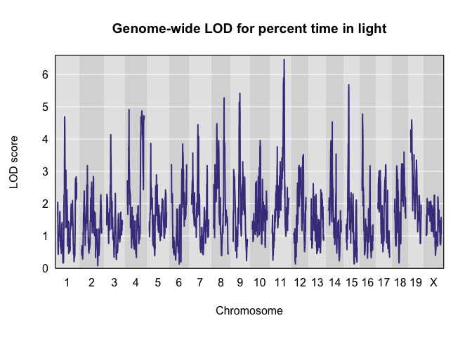

Recla analysis: Updated figures
================
Frederick Boehm
2018-11-20 10:16:10

## Read pvl scan results from files

``` r
library(dplyr)
```

    ## 
    ## Attaching package: 'dplyr'

    ## The following objects are masked from 'package:stats':
    ## 
    ##     filter, lag

    ## The following objects are masked from 'package:base':
    ## 
    ##     intersect, setdiff, setequal, union

``` r
library(ggplot2)
as_tibble(read.table("recla-07-10.txt")) -> pvl0710
as_tibble(read.table("recla-07-22.txt")) -> pvl0722
as_tibble(read.table("recla-10-22.txt")) -> pvl1022
```

## Load Recla from qtl2data

``` r
library(qtl2)
file <- paste0("https://raw.githubusercontent.com/rqtl/",
               "qtl2data/master/DO_Recla/recla.zip")
recla <- read_cross2(file)
# make sex a covariate for use in qtl2pleio::scan_pvl
recla[[6]][ , 1, drop = FALSE] -> sex
# insert pseudomarkers
insert_pseudomarkers(recla, step = 0.10) -> pseudomap
gm <- pseudomap$`8`
```

``` r
probs <- calc_genoprob(recla, map = pseudomap)
```

We now convert the genotype probabilities to haplotype dosages.

``` r
aprobs <- genoprob_to_alleleprob(probs)
```

We now calculate kinship matrices, by the “leave one chromosome out
(loco)” method.

``` r
kinship <- calc_kinship(aprobs, "loco")
```

``` r
recla$pheno -> ph
log(ph) -> lph
apply(FUN = broman::winsorize, X = lph, MARGIN = 2) -> wlph
#colnames(wlph)[c(7, 10, 22)] <- c("distance traveled in light", "percent time in light", "hot plate latency")

as_tibble(wlph) -> wlph_tib
```

``` r
sex2 <- matrix(as.numeric(sex == "female"), ncol = 1)
colnames(sex2) <- "female"
rownames(sex2) <- rownames(aprobs[[1]])
out <- scan1(genoprobs = aprobs, pheno = wlph, kinship = kinship, addcovar = sex2, reml = TRUE)
```

``` r
(peaks <- find_peaks(out, pseudomap, threshold = 5) %>%
  arrange(chr, pos) %>%
   select(- lodindex))
```

    ##                    lodcolumn chr     pos      lod
    ## 1                         bw   1 23.9075 5.471580
    ## 2         OF_distance_first4   1 43.2385 5.772977
    ## 3             LD_transitions   1 95.8075 5.028258
    ## 4                OF_distance   2 49.9770 5.544458
    ## 5                         bw   2 52.3932 7.352334
    ## 6            OF_immobile_pct   2 53.2646 9.771813
    ## 7  VC_bottom_distance_first4   2 71.0160 6.531654
    ## 8         OF_distance_first4   3 10.7360 5.541166
    ## 9  VC_bottom_distance_first4   3 16.3700 5.518637
    ## 10           VC_top_time_pct   3 17.9390 5.951067
    ## 11         LD_distance_light   3 23.4390 5.203246
    ## 12                        bw   3 24.8390 5.632714
    ## 13        VC_top_time_first4   3 48.1280 6.144073
    ## 14           VC_top_velocity   3 48.5630 6.264824
    ## 15        VC_top_time_first4   4  3.5340 5.016970
    ## 16             OF_corner_pct   4  9.0111 6.272996
    ## 17           OF_immobile_pct   4 37.5206 5.529985
    ## 18         LD_distance_light   4 71.2992 5.040185
    ## 19                        bw   5 10.0740 5.728865
    ## 20 VC_bottom_distance_first4   5 19.9741 5.419061
    ## 21        VC_top_time_first4   5 20.0741 6.075282
    ## 22        VC_bottom_distance   5 20.5930 5.691913
    ## 23        VC_bottom_time_pct   5 20.5930 6.360001
    ## 24       TS_latency_immobile   5 43.3504 5.995115
    ## 25             OF_corner_pct   5 64.2551 5.665658
    ## 26           OF_immobile_pct   6 53.4292 6.968771
    ## 27     TS_frequency_climbing   6 57.0362 5.361091
    ## 28                        bw   7  9.1778 6.057098
    ## 29          TS_time_immobile   7 49.4778 8.067612
    ## 30        VC_bottom_distance   7 54.5591 5.011113
    ## 31        OF_distance_first4   7 57.9454 5.327302
    ## 32           VC_top_distance   7 83.8778 5.724788
    ## 33           OF_immobile_pct   7 83.9778 5.823556
    ## 34     TS_frequency_climbing   8 48.1732 5.483064
    ## 35         LD_distance_light   8 55.2762 5.323391
    ## 36              LD_light_pct   8 55.2762 5.274185
    ## 37                HP_latency   8 57.7732 6.223739
    ## 38         LD_distance_light   9 36.6965 5.196968
    ## 39              LD_light_pct   9 36.6965 5.417419
    ## 40        VC_top_time_first4   9 38.4834 5.109813
    ## 41           VC_top_time_pct   9 39.2680 6.356432
    ## 42                HP_latency   9 46.8502 5.222074
    ## 43                        bw  10  3.7781 6.526199
    ## 44        OF_distance_first4  10 29.6698 5.462975
    ## 45        VC_bottom_time_pct  10 32.5438 5.432804
    ## 46          OF_periphery_pct  10 74.8530 5.246487
    ## 47           VC_top_distance  11  7.8200 6.245803
    ## 48    VC_top_distance_first4  11 11.6236 5.486915
    ## 49 VC_bottom_distance_first4  11 54.3420 5.367052
    ## 50            LD_transitions  11 58.9000 5.903217
    ## 51     VC_bottom_transitions  11 60.5984 5.114051
    ## 52              LD_light_pct  11 63.3943 6.464176
    ## 53         LD_distance_light  11 63.4514 6.373437
    ## 54           VC_top_time_pct  12 20.5776 6.950144
    ## 55        VC_bottom_velocity  12 21.7760 5.653292
    ## 56             OF_center_pct  12 35.5140 6.399422
    ## 57                HP_latency  12 43.5150 5.131074
    ## 58          OF_periphery_pct  12 53.5776 7.240951
    ## 59             OF_corner_pct  13 59.7966 6.594594
    ## 60     VC_bottom_time_first4  14 11.9183 5.204369
    ## 61 VC_bottom_distance_first4  14 12.5316 5.763233
    ## 62     VC_bottom_transitions  14 12.5316 6.478533
    ## 63           VC_top_velocity  14 12.7819 6.840412
    ## 64        VC_bottom_distance  14 14.5316 5.592030
    ## 65     TS_frequency_climbing  14 21.1141 5.372594
    ## 66             OF_center_pct  14 53.7316 5.377182
    ## 67     TS_frequency_climbing  15 12.6680 6.043265
    ## 68              LD_light_pct  15 15.2374 5.674922
    ## 69        OF_distance_first4  16 23.2656 5.242101
    ## 70           VC_top_distance  17 15.6390 6.669275
    ## 71           VC_top_velocity  18  8.3750 5.558628
    ## 72        VC_top_time_first4  18 17.8068 6.246206
    ## 73            LD_transitions  18 37.4182 5.090332
    ## 74 VC_bottom_distance_first4  19 24.9615 7.362557
    ## 75     VC_bottom_time_first4  19 24.9615 7.499959
    ## 76           OF_immobile_pct  19 31.9505 5.639812
    ## 77                HP_latency  19 47.7977 5.485000

``` r
peaks8 <- peaks %>%
  filter(chr == 8, pos > 50, pos < 60)
pos_LD_light_pct <- peaks8 %>%
  filter(lodcolumn == "LD_light_pct") %>%
  select(pos)
pos_HP_latency <- peaks8 %>%
  filter(lodcolumn == "HP_latency") %>%
  select(pos)
```

## Find peaks for two traits

Make a supplementary table for
manuscript.

``` r
xtable::xtable(find_peaks(out[, c(10, 22)], pseudomap, threshold = 5) %>%
  arrange(chr, pos) %>%
   select(- lodindex))
```

    ## % latex table generated in R 3.5.1 by xtable 1.8-3 package
    ## % Tue Nov 20 10:28:47 2018
    ## \begin{table}[ht]
    ## \centering
    ## \begin{tabular}{rllrr}
    ##   \hline
    ##  & lodcolumn & chr & pos & lod \\ 
    ##   \hline
    ## 1 & LD\_light\_pct & 8 & 55.28 & 5.27 \\ 
    ##   2 & HP\_latency & 8 & 57.77 & 6.22 \\ 
    ##   3 & LD\_light\_pct & 9 & 36.70 & 5.42 \\ 
    ##   4 & HP\_latency & 9 & 46.85 & 5.22 \\ 
    ##   5 & LD\_light\_pct & 11 & 63.39 & 6.46 \\ 
    ##   6 & HP\_latency & 12 & 43.52 & 5.13 \\ 
    ##   7 & LD\_light\_pct & 15 & 15.24 & 5.67 \\ 
    ##   8 & HP\_latency & 19 & 47.80 & 5.48 \\ 
    ##    \hline
    ## \end{tabular}
    ## \end{table}

## Correlation

Given that the two traits “percent time in light” and “distance traveled
in light” share a peak, we want to ask how correlated they are.

``` r
cor(wlph[ , 7], wlph[ , 10], use = "complete.obs")
```

    ## [1] 0.8859402

``` r
cor(wlph[ , 22], wlph[ , 10], use = "complete.obs")
```

    ## [1] -0.1507317

``` r
cor(wlph[ , 7], wlph[ , 22], use = "complete.obs")
```

    ## [1] -0.143598

## Plots

``` r
library(qtl2pleio)
colnames(recla$pheno)[c(10, 22)] <- c("Percent time in light", "Hot plate latency")
p1022 <- tidy_scan_pvl(pvl1022, pmap = gm) %>%
  add_intercepts(c(as.numeric(pos_LD_light_pct), as.numeric(pos_HP_latency))) %>%
  plot_pvl(phenames = colnames(recla$pheno)[c(10, 22)]) + ggtitle("Chromosome 8 profile LOD for percent time in light and hot plate latency")
```

    ## Warning: Column `marker1`/`marker` joining factor and character vector,
    ## coercing into character vector

    ## Warning: Column `marker2`/`marker` joining factor and character vector,
    ## coercing into character vector

``` r
ggsave(filename = paste0(lubridate::today(), "-profile.eps"), plot = p1022)
```

    ## Saving 7 x 5 in image

    ## Warning: Removed 208 rows containing missing values (geom_path).

``` r
ggsave(filename = paste0(lubridate::today(), "-profile.svg"), plot = p1022)
```

    ## Saving 7 x 5 in image

    ## Warning: Removed 208 rows containing missing values (geom_path).

## Scatter plot of phenotypes

``` r
scatter1022 <- ggplot() + geom_point(data = wlph_tib, aes(y = HP_latency, x = LD_light_pct)) + labs(x = "Percent time in light", y = "Hot plate latency") + ggtitle("Scatterplot of hot plate latency vs. percent time in light")
ggsave(filename = paste0(lubridate::today(), "-scatter.eps"), plot = scatter1022)
```

    ## Saving 7 x 5 in image

    ## Warning: Removed 3 rows containing missing values (geom_point).

``` r
ggsave(filename = paste0(lubridate::today(), "-scatter.svg"), plot = scatter1022)
```

    ## Saving 7 x 5 in image

    ## Warning: Removed 3 rows containing missing values (geom_point).

## Genome-wide LOD plots for the traits from Recla

``` r
#setEPS()
#postscript("genomewide_lod_trait10.eps")
plot(out, map = pseudomap, lodcolumn = 10, main = "Genome-wide LOD for percent time in light")
```

<!-- -->

``` r
#dev.off()
```

``` r
#setEPS()
#postscript("genomewide_lod_trait22.eps")
plot(out, map = pseudomap, lodcolumn = 22, main = "Genome-wide LOD for hot plate latency")
```

<!-- -->

``` r
#dev.off()
```

``` r
setEPS()
postscript(paste0(lubridate::today(), "-genomewide_lod_trait10.eps"))
plot(out, map = pseudomap, lodcolumn = 10, main = "Genome-wide LOD for percent time in light")
dev.off()
```

    ## quartz_off_screen 
    ##                 2

``` r
svg(paste0(lubridate::today(), "-genomewide_lod_trait10.svg"))
plot(out, map = pseudomap, lodcolumn = 10, main = "Genome-wide LOD for percent time in light")
dev.off()
```

    ## quartz_off_screen 
    ##                 2

``` r
setEPS()
postscript(paste0(lubridate::today(), "-genomewide_lod_trait22.eps"))
plot(out, map = pseudomap, lodcolumn = 22, main = "Genome-wide LOD for hot plate latency")
dev.off()
```

    ## quartz_off_screen 
    ##                 2

``` r
svg(paste0(lubridate::today(), "-genomewide_lod_trait22.svg"))
plot(out, map = pseudomap, lodcolumn = 22, main = "Genome-wide LOD for hot plate latency")
dev.off()
```

    ## quartz_off_screen 
    ##                 2

## LOD plots for both traits on Chromosome 8

``` r
# first, look at dimensions of `out`
dim(out)
```

    ## [1] 20205    26

``` r
cumsum_map_lengths <- sapply(FUN = length, X = pseudomap) %>%
  cumsum()
out[(cumsum_map_lengths[7] + 650):(cumsum_map_lengths[7] + 999), ] -> chr8_lods
setEPS()
postscript(paste0(lubridate::today(), "-chr8-lods.eps"))
par(mfrow = c(2, 1))
plot_scan1(chr8_lods, chr = 8, map = pseudomap, lodcolumn = 10, main = "Chromosome 8 LOD for percent time in light")
plot_scan1(chr8_lods, chr = 8, map = pseudomap, lodcolumn = 22, main = "Chromosome 8 LOD for hot plate latency")
dev.off()
```

    ## quartz_off_screen 
    ##                 2

## Allele effects plots on chr 8 for Recla traits

``` r
scan1coef(aprobs[ , 8], pheno = wlph[, 10], kinship = kinship$`8`, 
          reml = TRUE,
          addcovar = sex2) -> s1c_10
scan1coef(aprobs[ , 8], pheno = wlph[, 22], kinship = kinship$`8`, 
          reml = TRUE,
          addcovar = sex2) -> s1c_22
```

``` r
# ensure that subsets are scan1output objects
s1c_10s <- s1c_10[650:999, 1:8]
s1c_22s <- s1c_22[650:999, 1:8]
```

``` r
setEPS()
postscript(paste0(lubridate::today(), "-coefs.eps"))
par(mfrow = c(2, 1))
plot_coefCC(s1c_10s, map = pseudomap, main = "Allele effects for percent time in light", legend = "topright")
plot_coefCC(s1c_22s, map = pseudomap, main = "Allele effects for hot plate latency")
dev.off()
```

    ## quartz_off_screen 
    ##                 2

``` r
svg(paste0(lubridate::today(), "-coefs.svg"))
par(mfrow = c(2, 1))
plot_coefCC(s1c_10s, map = pseudomap, main = "Allele effects for percent time in light", legend = "topright")
plot_coefCC(s1c_22s, map = pseudomap, main = "Allele effects for hot plate latency")
dev.off()
```

    ## quartz_off_screen 
    ##                 2

## Session info

``` r
devtools::session_info()
```

    ## ─ Session info ──────────────────────────────────────────────────────────
    ##  setting  value                       
    ##  version  R version 3.5.1 (2018-07-02)
    ##  os       macOS  10.14.1              
    ##  system   x86_64, darwin15.6.0        
    ##  ui       X11                         
    ##  language (EN)                        
    ##  collate  en_US.UTF-8                 
    ##  ctype    en_US.UTF-8                 
    ##  tz       America/Chicago             
    ##  date     2018-11-20                  
    ## 
    ## ─ Packages ──────────────────────────────────────────────────────────────
    ##  package     * version    date       lib source                        
    ##  assertthat    0.2.0      2017-04-11 [1] CRAN (R 3.5.0)                
    ##  backports     1.1.2      2017-12-13 [1] CRAN (R 3.5.0)                
    ##  base64enc     0.1-3      2015-07-28 [1] CRAN (R 3.5.0)                
    ##  bindr         0.1.1      2018-03-13 [1] CRAN (R 3.5.0)                
    ##  bindrcpp    * 0.2.2      2018-03-29 [1] CRAN (R 3.5.0)                
    ##  bit           1.1-14     2018-05-29 [1] CRAN (R 3.5.0)                
    ##  bit64         0.9-7      2017-05-08 [1] CRAN (R 3.5.0)                
    ##  blob          1.1.1      2018-03-25 [1] CRAN (R 3.5.0)                
    ##  broman        0.68-2     2018-07-25 [1] CRAN (R 3.5.0)                
    ##  callr         3.0.0      2018-08-24 [1] CRAN (R 3.5.0)                
    ##  cli           1.0.1      2018-09-25 [1] CRAN (R 3.5.0)                
    ##  colorspace    1.3-2      2016-12-14 [1] CRAN (R 3.5.0)                
    ##  crayon        1.3.4      2017-09-16 [1] CRAN (R 3.5.0)                
    ##  data.table    1.11.8     2018-09-30 [1] CRAN (R 3.5.0)                
    ##  DBI           1.0.0      2018-05-02 [1] CRAN (R 3.5.0)                
    ##  desc          1.2.0      2018-05-01 [1] CRAN (R 3.5.0)                
    ##  devtools      2.0.1      2018-10-26 [1] CRAN (R 3.5.1)                
    ##  digest        0.6.18     2018-10-10 [1] CRAN (R 3.5.0)                
    ##  dplyr       * 0.7.8      2018-11-10 [1] CRAN (R 3.5.0)                
    ##  evaluate      0.12       2018-10-09 [1] CRAN (R 3.5.0)                
    ##  fs            1.2.6      2018-08-23 [1] CRAN (R 3.5.0)                
    ##  gdtools     * 0.1.7      2018-02-27 [1] CRAN (R 3.5.0)                
    ##  ggplot2     * 3.1.0      2018-10-25 [1] CRAN (R 3.5.0)                
    ##  glue          1.3.0      2018-07-17 [1] CRAN (R 3.5.0)                
    ##  gtable        0.2.0      2016-02-26 [1] CRAN (R 3.5.0)                
    ##  htmltools     0.3.6      2017-04-28 [1] CRAN (R 3.5.0)                
    ##  jsonlite      1.5        2017-06-01 [1] CRAN (R 3.5.0)                
    ##  knitr         1.20       2018-02-20 [1] CRAN (R 3.5.0)                
    ##  labeling      0.3        2014-08-23 [1] CRAN (R 3.5.0)                
    ##  lazyeval      0.2.1      2017-10-29 [1] CRAN (R 3.5.0)                
    ##  lubridate     1.7.4      2018-04-11 [1] CRAN (R 3.5.0)                
    ##  magrittr      1.5        2014-11-22 [1] CRAN (R 3.5.0)                
    ##  memoise       1.1.0      2017-04-21 [1] CRAN (R 3.5.0)                
    ##  munsell       0.5.0      2018-06-12 [1] CRAN (R 3.5.0)                
    ##  pillar        1.3.0      2018-07-14 [1] CRAN (R 3.5.0)                
    ##  pkgbuild      1.0.2      2018-10-16 [1] CRAN (R 3.5.0)                
    ##  pkgconfig     2.0.2      2018-08-16 [1] CRAN (R 3.5.0)                
    ##  pkgload       1.0.2      2018-10-29 [1] CRAN (R 3.5.0)                
    ##  plyr          1.8.4      2016-06-08 [1] CRAN (R 3.5.0)                
    ##  prettyunits   1.0.2      2015-07-13 [1] CRAN (R 3.5.0)                
    ##  processx      3.2.0      2018-08-16 [1] CRAN (R 3.5.0)                
    ##  ps            1.2.1      2018-11-06 [1] CRAN (R 3.5.0)                
    ##  purrr         0.2.5      2018-05-29 [1] CRAN (R 3.5.0)                
    ##  qtl2        * 0.17-9     2018-11-18 [1] Github (rqtl/qtl2@1c007a2)    
    ##  qtl2pleio   * 0.1.2.9000 2018-11-18 [1] local                         
    ##  R6            2.3.0      2018-10-04 [1] CRAN (R 3.5.0)                
    ##  Rcpp          1.0.0.1    2018-11-18 [1] Github (RcppCore/Rcpp@4f168e6)
    ##  remotes       2.0.2      2018-10-30 [1] CRAN (R 3.5.0)                
    ##  rlang         0.3.0.1    2018-10-25 [1] CRAN (R 3.5.0)                
    ##  rmarkdown     1.10       2018-06-11 [1] CRAN (R 3.5.0)                
    ##  rprojroot     1.3-2      2018-01-03 [1] CRAN (R 3.5.0)                
    ##  RSQLite       2.1.1      2018-05-06 [1] CRAN (R 3.5.0)                
    ##  scales        1.0.0      2018-08-09 [1] CRAN (R 3.5.0)                
    ##  sessioninfo   1.1.1      2018-11-05 [1] CRAN (R 3.5.0)                
    ##  stringi       1.2.4      2018-07-20 [1] CRAN (R 3.5.0)                
    ##  stringr       1.3.1      2018-05-10 [1] CRAN (R 3.5.0)                
    ##  svglite       1.2.1      2017-09-11 [1] CRAN (R 3.5.0)                
    ##  testthat      2.0.1      2018-10-13 [1] CRAN (R 3.5.0)                
    ##  tibble        1.4.2      2018-01-22 [1] CRAN (R 3.5.0)                
    ##  tidyselect    0.2.5      2018-10-11 [1] CRAN (R 3.5.0)                
    ##  usethis       1.4.0      2018-08-14 [1] CRAN (R 3.5.0)                
    ##  withr         2.1.2      2018-03-15 [1] CRAN (R 3.5.0)                
    ##  xtable        1.8-3      2018-08-29 [1] CRAN (R 3.5.0)                
    ##  yaml          2.2.0      2018-07-25 [1] CRAN (R 3.5.0)                
    ## 
    ## [1] /Library/Frameworks/R.framework/Versions/3.5/Resources/library
