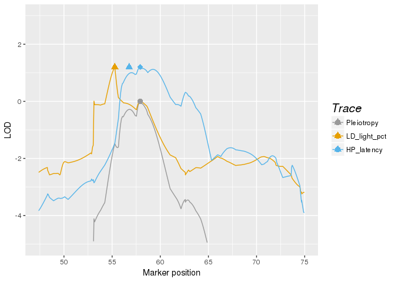
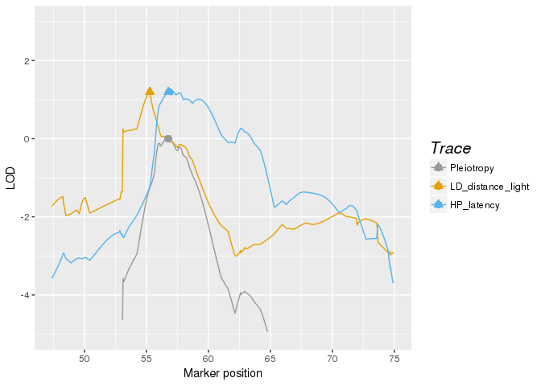
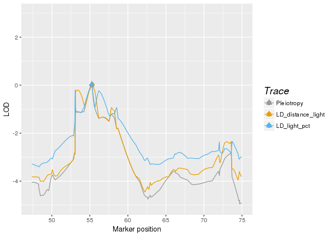

Recla data analysis
================
Frederick Boehm
2018-03-11 10:07:40

### Load data

``` {.r}
library(ggplot2)
library(qtl2)
file <- paste0("https://raw.githubusercontent.com/rqtl/",
               "qtl2data/master/DO_Recla/recla.zip")
recla <- read_cross2(file)
# make sex a covariate for use in pvl_scan
recla[[6]][ , 1, drop = FALSE] -> sex
# insert pseudomarkers
insert_pseudomarkers(recla, step = 0.10) -> pseudomap
```

``` {.r}
probs <- calc_genoprob(recla, map = pseudomap)
```

We now convert the genotype probabilities to haplotype dosages.

``` {.r}
aprobs <- genoprob_to_alleleprob(probs)
```

We now calculate kinship matrices, by the "leave one chromosome out (loco)" method.

``` {.r}
kinship <- calc_kinship(aprobs, "loco")
```

Find genomic region on chr 8
----------------------------

``` {.r}
length(pseudomap$`8`)
```

    ## [1] 1010

``` {.r}
gm <- pseudomap$`8`
```

Genome scans of all phenotypes, after log transform and winsorization.

``` {.r}
recla$pheno -> ph
log(ph) -> lph
apply(FUN = broman::winsorize, X = lph, MARGIN = 2) -> wlph
```

``` {.r}
out <- scan1(aprobs, wlph, kinship)
```

Here are the peaks above 5.

``` {.r}
library(dplyr)
(peaks <- find_peaks(out, pseudomap, threshold = 5) %>%
  arrange(chr, pos))
```

    ##    lodindex                 lodcolumn chr      pos       lod
    ## 1         1        OF_distance_first4   1  43.2385  5.788067
    ## 2         2               OF_distance   2  49.9770  5.127010
    ## 3         5           OF_immobile_pct   2  52.8646 10.224156
    ## 4        16 VC_bottom_distance_first4   2  70.9646  6.419621
    ## 5        26                        bw   2 100.9168  5.303898
    ## 6         1        OF_distance_first4   3  10.7360  5.548135
    ## 7        16 VC_bottom_distance_first4   3  16.3700  5.212627
    ## 8        14           VC_top_time_pct   3  18.0390  6.059737
    ## 9         7         LD_distance_light   3  23.4390  5.267017
    ## 10       12        VC_top_time_first4   3  48.1280  6.054755
    ## 11       15           VC_top_velocity   3  48.5630  6.246314
    ## 12        8            LD_transitions   3  63.6289  5.149258
    ## 13        3             OF_corner_pct   4   8.9111  6.437580
    ## 14        5           OF_immobile_pct   4  38.3111  5.365040
    ## 15       26                        bw   4  56.8020  5.031871
    ## 16        7         LD_distance_light   4  71.2992  5.042915
    ## 17       16 VC_bottom_distance_first4   5  19.8741  5.446998
    ## 18       12        VC_top_time_first4   5  20.0741  6.040967
    ## 19       18        VC_bottom_distance   5  20.5930  5.559313
    ## 20       19        VC_bottom_time_pct   5  20.5930  6.339978
    ## 21       25       TS_latency_immobile   5  43.3504  6.277722
    ## 22        3             OF_corner_pct   5  64.2551  5.697947
    ## 23        5           OF_immobile_pct   6  53.4292  6.204592
    ## 24       23     TS_frequency_climbing   6  57.0362  5.261191
    ## 25       26                        bw   7  13.7300  6.896109
    ## 26        4          OF_periphery_pct   7  41.7912  5.468469
    ## 27        5           OF_immobile_pct   7  49.6778  5.231429
    ## 28       24          TS_time_immobile   7  49.6778  8.048518
    ## 29        1        OF_distance_first4   7  57.9454  5.414851
    ## 30       13           VC_top_distance   7  86.0491  5.399265
    ## 31       23     TS_frequency_climbing   8  48.1732  5.564503
    ## 32        7         LD_distance_light   8  55.2762  5.236018
    ## 33       10              LD_light_pct   8  55.2762  5.335456
    ## 34       22                HP_latency   8  56.7732  6.051230
    ## 35       26                        bw   9  33.0067  5.488590
    ## 36        7         LD_distance_light   9  36.6965  5.170923
    ## 37       10              LD_light_pct   9  36.6965  5.335588
    ## 38       12        VC_top_time_first4   9  38.4834  5.099533
    ## 39       14           VC_top_time_pct   9  39.1680  6.342866
    ## 40       22                HP_latency   9  46.8502  5.340047
    ## 41        1        OF_distance_first4  10  29.7530  5.456199
    ## 42       19        VC_bottom_time_pct  10  32.5438  5.459850
    ## 43       26                        bw  10  47.8530  5.038663
    ## 44       13           VC_top_distance  11   7.8200  6.141333
    ## 45       16 VC_bottom_distance_first4  11  54.3420  5.547568
    ## 46        8            LD_transitions  11  58.9000  5.384162
    ## 47       21     VC_bottom_transitions  11  60.5984  5.347443
    ## 48       10              LD_light_pct  11  63.3943  6.463179
    ## 49        7         LD_distance_light  11  63.4514  6.390085
    ## 50       14           VC_top_time_pct  12  20.4776  7.080590
    ## 51       20        VC_bottom_velocity  12  21.7760  5.606376
    ## 52        6             OF_center_pct  12  35.5140  6.406918
    ## 53       22                HP_latency  12  43.7776  5.642095
    ## 54        4          OF_periphery_pct  12  53.8776  7.324658
    ## 55        3             OF_corner_pct  13  59.7966  6.582044
    ## 56       17     VC_bottom_time_first4  14  11.9183  5.003965
    ## 57       16 VC_bottom_distance_first4  14  12.5316  5.319445
    ## 58       21     VC_bottom_transitions  14  12.5316  5.943461
    ## 59       15           VC_top_velocity  14  12.7819  6.775295
    ## 60       18        VC_bottom_distance  14  14.5316  5.250915
    ## 61       23     TS_frequency_climbing  14  21.1141  5.432374
    ## 62        6             OF_center_pct  14  54.1316  5.160479
    ## 63       23     TS_frequency_climbing  15  12.6680  6.024861
    ## 64       10              LD_light_pct  15  15.2374  5.727106
    ## 65        1        OF_distance_first4  16  23.2656  5.234713
    ## 66        5           OF_immobile_pct  17   7.7049  5.082184
    ## 67       13           VC_top_distance  17  15.7582  6.608871
    ## 68       26                        bw  17  59.7330  5.332256
    ## 69       15           VC_top_velocity  18   8.3750  5.580258
    ## 70       12        VC_top_time_first4  18  18.1850  6.478477
    ## 71        8            LD_transitions  18  37.3182  5.037067
    ## 72       16 VC_bottom_distance_first4  19  24.9615  7.209821
    ## 73       17     VC_bottom_time_first4  19  24.9615  7.450061
    ## 74       22                HP_latency  19  47.7977  5.467152
    ## 75       26                        bw   X  57.2600  6.321700

``` {.r}
peaks8 <- peaks %>%
  filter(chr == 8, pos > 50, pos < 60
         )
pos_LD_distance_light <- peaks8 %>%
  filter(lodcolumn == "LD_distance_light") %>%
  select(pos)
pos_LD_light_pct <- peaks8 %>%
  filter(lodcolumn == "LD_light_pct") %>%
  select(pos)
pos_HP_latency <- peaks8 %>%
  filter(lodcolumn == "HP_latency") %>%
  select(pos)
```

HP\_latency also maps to chrom 8, where two LD traits map. Columns 7, 10, and 22 are needed.

Examine 3 pairs on chrom 8
--------------------------

Let's consider the three phenotypes that map to approximately 55-57 cM on chromosome 8.

LD\_distance\_light (col 7) LD\_light\_pct (col 10) HP\_latency (col 22)

Recall that Recla et al believe that *Hydin* is the gene responsible for the HP\_latency phenotype.

Let's consider first HP\_latency and LD\_light\_pct

### HP\_latency and LD\_light\_pct

``` {.r}
pp <- aprobs$`8`
```

``` {.r}
library(qtl2pleio)
library(dplyr)
```

The calls to `scan_pvl` below take about 2 hours each on my macbook pro. I added a progress meter so that you know the estimated completion time.

``` {.r}
sex2 <- sex == "female"
# next line takes ~2h to complete
scan_pvl(probs = pp, pheno = wlph[, c(10, 22)], covariates = sex2, kinship = kinship$`8`, start_snp1 = 650, n_snp = 350) -> s1_out
```

    ## 3 subjects dropped due to missing values

``` {.r}
calc_lrt_tib(s1_out)
```

    ## [1] 2.771408

### LD\_distance\_light & HP\_latency

``` {.r}
# next line takes ~2h to complete
scan_pvl(probs = pp, pheno = wlph[, c(7, 22)], covariates = sex2, kinship = kinship$`8`, start_snp1 = 650, n_snp = 350) -> s2_out
calc_lrt_tib(s2_out)
```

    ## [1] 2.759916

### LD\_distance\_light & LD\_light\_pct

``` {.r}
# next line takes ~2h to complete
scan_pvl(probs = pp, pheno = wlph[, c(7, 10)], covariates = sex2, kinship = kinship$`8`, start_snp1 = 650, n_snp = 350) -> s3_out
```

    ## 3 subjects dropped due to missing values

``` {.r}
calc_lrt_tib(s3_out)
```

    ## [1] 0.09387654

Plots
-----

``` {.r}
tidy_scan_pvl(s1_out, pmap = gm) %>%
  add_intercepts(c(as.numeric(pos_LD_light_pct), as.numeric(pos_HP_latency))) %>%
  plot_pvl(phenames = colnames(recla$pheno)[c(10, 22)])
```

    ## Warning: Removed 208 rows containing missing values (geom_path).



``` {.r}
ggsave("2018-03-09_recla-10-22.png")
```

    ## Saving 7 x 5 in image

    ## Warning: Removed 208 rows containing missing values (geom_path).

``` {.r}
tidy_scan_pvl(s2_out, pmap = gm) %>%
  add_intercepts(c(as.numeric(pos_LD_distance_light), as.numeric(pos_HP_latency))) %>%
  plot_pvl(phenames = colnames(recla$pheno)[c(7, 22)])
```

    ## Warning: Removed 209 rows containing missing values (geom_path).



``` {.r}
ggsave("2018-03-09_recla-07-22.png")
```

    ## Saving 7 x 5 in image

    ## Warning: Removed 209 rows containing missing values (geom_path).

``` {.r}
tidy_scan_pvl(s3_out, pmap = gm) %>%
  add_intercepts(c(as.numeric(pos_LD_distance_light), as.numeric(pos_LD_light_pct))) %>%
  plot_pvl(phenames = colnames(recla$pheno)[c(7, 10)])
```



``` {.r}
ggsave("2018-03-09_recla-07-10.png")
```

    ## Saving 7 x 5 in image

Find the indices for the *pleiotropy peaks*
-------------------------------------------

``` {.r}
find_pleio_peak_tib(s1_out)
```

    ## loglik139 
    ##       788

``` {.r}
find_pleio_peak_tib(s2_out)
```

    ## loglik124 
    ##       773

``` {.r}
find_pleio_peak_tib(s3_out)
```

    ## loglik106 
    ##       755

``` {.r}
devtools::session_info()
```

    ## Session info -------------------------------------------------------------

    ##  setting  value                       
    ##  version  R version 3.3.1 (2016-06-21)
    ##  system   x86_64, linux-gnu           
    ##  ui       X11                         
    ##  language (EN)                        
    ##  collate  en_US.UTF-8                 
    ##  tz       America/Chicago             
    ##  date     2018-03-11

    ## Packages -----------------------------------------------------------------

    ##  package     * version  date       source                           
    ##  assertthat    0.2.0    2017-04-11 CRAN (R 3.3.1)                   
    ##  backports     1.1.0    2017-05-22 CRAN (R 3.3.1)                   
    ##  base        * 3.3.1    2016-06-28 local                            
    ##  bindr         0.1      2016-11-13 CRAN (R 3.3.1)                   
    ##  bindrcpp    * 0.2      2017-06-17 CRAN (R 3.3.1)                   
    ##  bit           1.1-12   2014-04-09 CRAN (R 3.3.1)                   
    ##  bit64         0.9-7    2017-05-08 CRAN (R 3.3.1)                   
    ##  blob          1.1.0    2017-06-17 cran (@1.1.0)                    
    ##  broman        0.67-4   2017-12-08 CRAN (R 3.3.1)                   
    ##  colorspace    1.3-2    2016-12-14 CRAN (R 3.3.1)                   
    ##  data.table    1.10.4-3 2017-10-27 cran (@1.10.4-)                  
    ##  datasets    * 3.3.1    2016-06-28 local                            
    ##  DBI           0.7      2017-06-18 CRAN (R 3.3.1)                   
    ##  devtools      1.13.5   2018-02-18 CRAN (R 3.3.1)                   
    ##  digest        0.6.12   2017-01-27 CRAN (R 3.3.1)                   
    ##  dplyr       * 0.7.4    2017-09-28 cran (@0.7.4)                    
    ##  evaluate      0.10.1   2017-06-24 CRAN (R 3.3.1)                   
    ##  gemma2        0.0.1    2018-02-28 Github (fboehm/gemma2@221b37a)   
    ##  ggplot2     * 2.2.1    2016-12-30 CRAN (R 3.3.1)                   
    ##  glue          1.2.0    2017-10-29 cran (@1.2.0)                    
    ##  graphics    * 3.3.1    2016-06-28 local                            
    ##  grDevices   * 3.3.1    2016-06-28 local                            
    ##  grid          3.3.1    2016-06-28 local                            
    ##  gtable        0.2.0    2016-02-26 CRAN (R 3.2.2)                   
    ##  htmltools     0.3.6    2017-04-28 CRAN (R 3.3.1)                   
    ##  jsonlite      1.5      2017-06-01 CRAN (R 3.3.1)                   
    ##  knitr         1.16     2017-05-18 CRAN (R 3.3.1)                   
    ##  labeling      0.3      2014-08-23 CRAN (R 3.3.1)                   
    ##  lattice       0.20-33  2015-07-14 CRAN (R 3.3.1)                   
    ##  lazyeval      0.2.0    2016-06-12 CRAN (R 3.3.1)                   
    ##  lubridate     1.7.3    2018-02-27 CRAN (R 3.3.1)                   
    ##  magrittr      1.5      2014-11-22 CRAN (R 3.3.1)                   
    ##  Matrix        1.2-10   2017-04-28 CRAN (R 3.3.1)                   
    ##  memoise       1.1.0    2017-04-21 CRAN (R 3.3.1)                   
    ##  methods     * 3.3.1    2016-06-28 local                            
    ##  munsell       0.4.3    2016-02-13 CRAN (R 3.2.2)                   
    ##  mvtnorm       1.0-7    2018-01-26 cran (@1.0-7)                    
    ##  pillar        1.2.1    2018-02-27 cran (@1.2.1)                    
    ##  pkgconfig     2.0.1    2017-03-21 CRAN (R 3.3.1)                   
    ##  plyr          1.8.4    2016-06-08 CRAN (R 3.3.1)                   
    ##  prettyunits   1.0.2    2015-07-13 cran (@1.0.2)                    
    ##  progress      1.1.2    2016-12-14 cran (@1.1.2)                    
    ##  qtl2        * 0.12     2018-02-28 Github (rqtl/qtl2@635eef1)       
    ##  qtl2pleio   * 0.1.2    2018-03-05 Github (fboehm/qtl2pleio@d2fb4f7)
    ##  R6            2.2.2    2017-06-17 CRAN (R 3.3.1)                   
    ##  Rcpp          0.12.15  2018-01-20 cran (@0.12.15)                  
    ##  rlang         0.2.0    2018-02-20 cran (@0.2.0)                    
    ##  rmarkdown   * 1.6      2017-06-15 CRAN (R 3.3.1)                   
    ##  rprojroot     1.2      2017-01-16 CRAN (R 3.3.1)                   
    ##  RSQLite       2.0      2017-06-19 cran (@2.0)                      
    ##  scales        0.4.1    2016-11-09 CRAN (R 3.3.1)                   
    ##  stats       * 3.3.1    2016-06-28 local                            
    ##  stringi       1.1.6    2017-11-17 CRAN (R 3.3.1)                   
    ##  stringr       1.3.0    2018-02-19 CRAN (R 3.3.1)                   
    ##  tibble        1.4.2    2018-01-22 cran (@1.4.2)                    
    ##  tools         3.3.1    2016-06-28 local                            
    ##  utils       * 3.3.1    2016-06-28 local                            
    ##  withr         2.0.0    2017-07-28 CRAN (R 3.3.1)                   
    ##  yaml          2.1.14   2016-11-12 CRAN (R 3.3.1)
